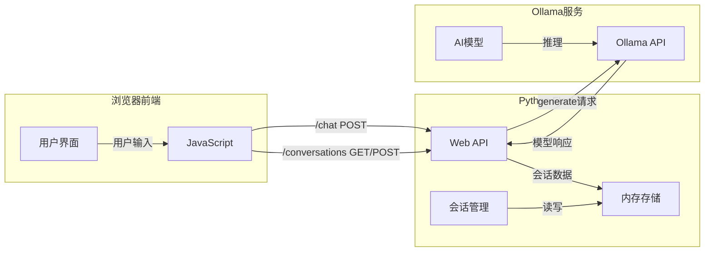

# Ollama Web Chat

一个基于Web的Ollama聊天应用，支持多会话管理的聊天界面，可以与本地运行的Ollama模型进行交互。

## 系统架构



## 功能特点

- 🚀 简洁现代的用户界面
- 💬 多会话管理
- 📝 聊天历史记录
- ⌨️ 支持快捷键操作
- 🔄 实时响应
- 📱 响应式设计

## 技术栈

- 后端：Python Flask
- 前端：HTML5 + CSS3 + JavaScript
- AI模型：Ollama API

## 系统要求

- Python 3.6+
- Ollama 服务
- 支持的浏览器：Chrome, Firefox, Safari, Edge (最新版本)

## 项目结构

## 项目结构

```
ollama-web-chat/
├── README.md                 # 项目说明文档
├── app.py                    # Flask应用主文件
├── requirements.txt          # Python依赖文件
├── static/                   # 静态资源目录
│   ├── script.js             # 主要的JavaScript逻辑
│   ├── style.css             # 样式表文件
│   └── images/              # 图片资源目录
│       └── favicon.ico      # 网站图标
└── templates/               # HTML模板目录
    └── index.html           # 主页面模板
```


## 安装步骤

1. 克隆项目：
```bash
git clone [项目地址]
cd ollama-web-chat
```

2. 安装后端依赖：
```bash
cd backend
pip install -r requirements.txt
```

3. 启动Ollama服务：
```bash
ollama serve
```

4. 启动Flask应用：
```bash
pip install -r requirements.txt
python app.py
```

5. 访问应用：
打开浏览器访问 http://localhost:5000

## 开发说明

### 前端开发
- 组件化开发，每个功能模块独立维护
- 使用CSS变量统一主题样式
- JavaScript采用类的方式组织代码
- API请求统一通过services层处理

### 后端开发
- RESTful API设计
- 使用Flask Session管理会话状态
- 采用内存存储方式管理对话历史

## 贡献指南

欢迎提交Issue和Pull Request！

## 许可证

MIT License
